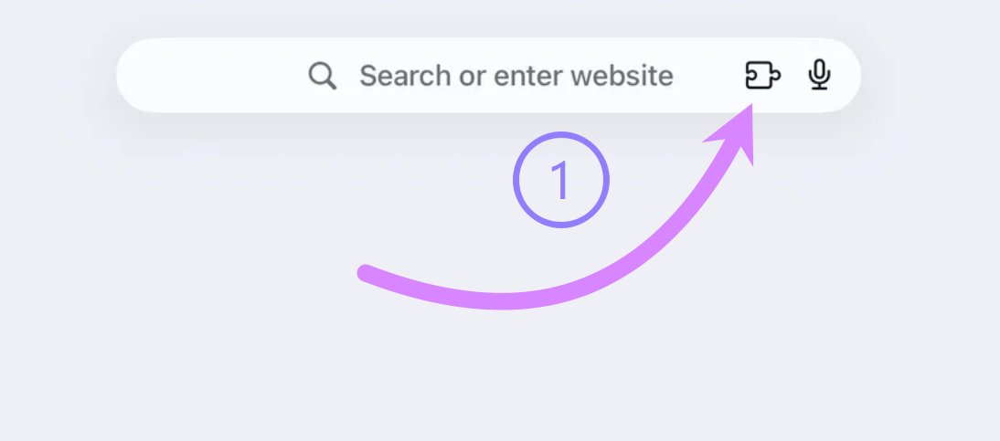
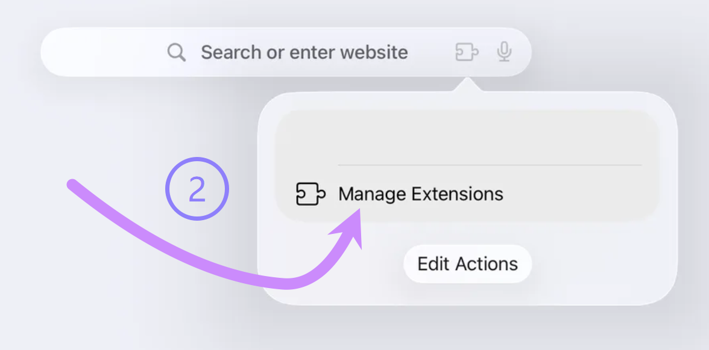
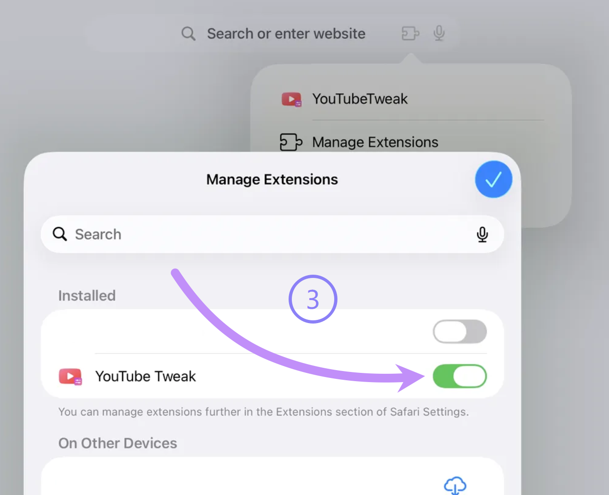
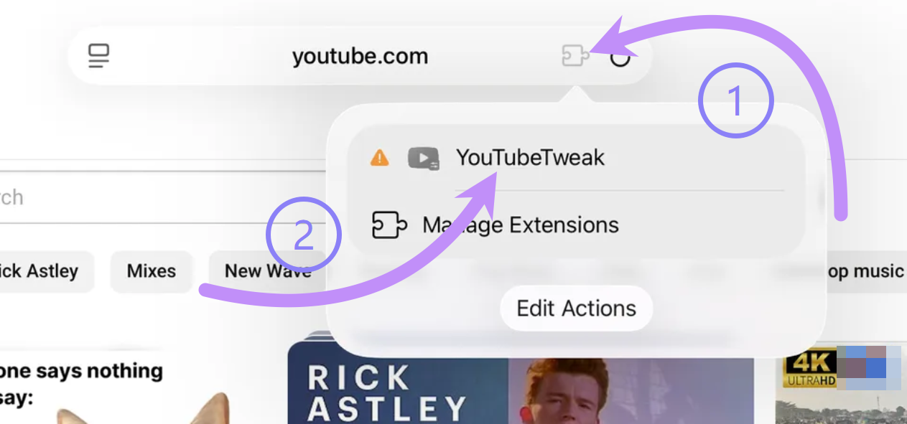
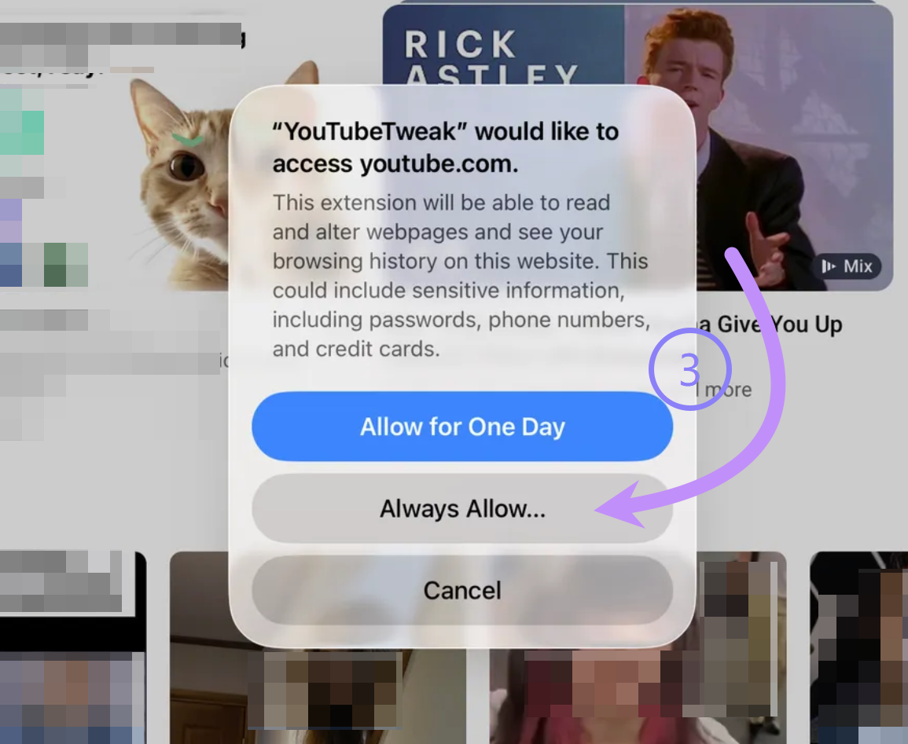
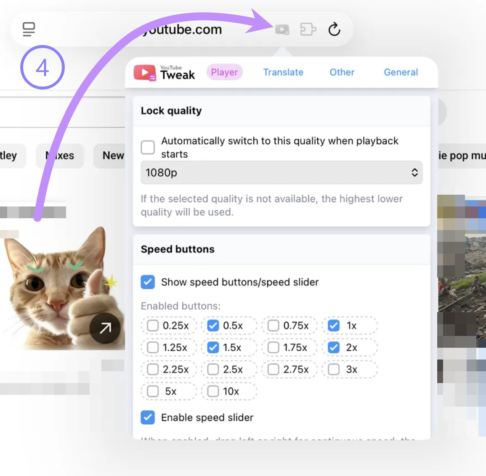

# Safari 拡張機能を有効化

ステップ 1、アドレスバー右側の拡張機能アイコンをクリックします

ステップ 2、`拡張機能を管理` をクリックします

ステップ 3、`YouTube Tweak` 拡張機能を有効状態に設定します

# YouTube サイトで拡張機能を使用、設定する

[YouTube.com](https://www.youtube.com) を開き、その後アドレスバーの拡張機能アイコンをクリックします。  
`YouTube Tweak` をクリックします。YouTube へのアクセスをまだ許可していない場合、アイコンは灰色で感嘆符付きで表示されます。

表示される確認ダイアログで、`常に許可` をクリックします

その後、この拡張機能は正常に動作します。アドレスバーの拡張機能アイコンをもう一度クリックすると、設定画面に入れます。

